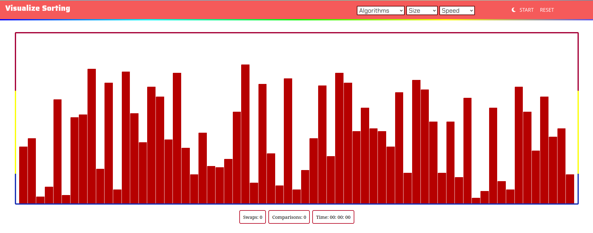
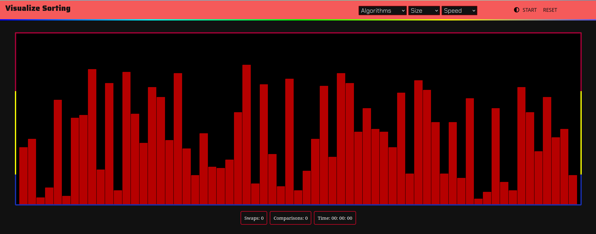

# VisualizeSorting

 A web application hosted on github pages, designed to showcase the visualization of renowned sorting algorithms including bubble sort, insertion sort, selection sort, merge sort, and quick sort.

 https://rajpratham13.github.io/Visualise_Sorting/VisualizeSorting-main/

## Tech Stack

   


## Installation

- Fork the Repository and clone it at the desired location

```bash
  git clone https://github.com/<UserName>/Visualize_Sorting.git
```
- Open Repository
```bash 
   cd Visualize_Sorting
```
- Open `index.html` with your browser or run using liveServer.

## Screenshot

- Dark Mode
  



## Contributing

Contributions are always welcome :)


